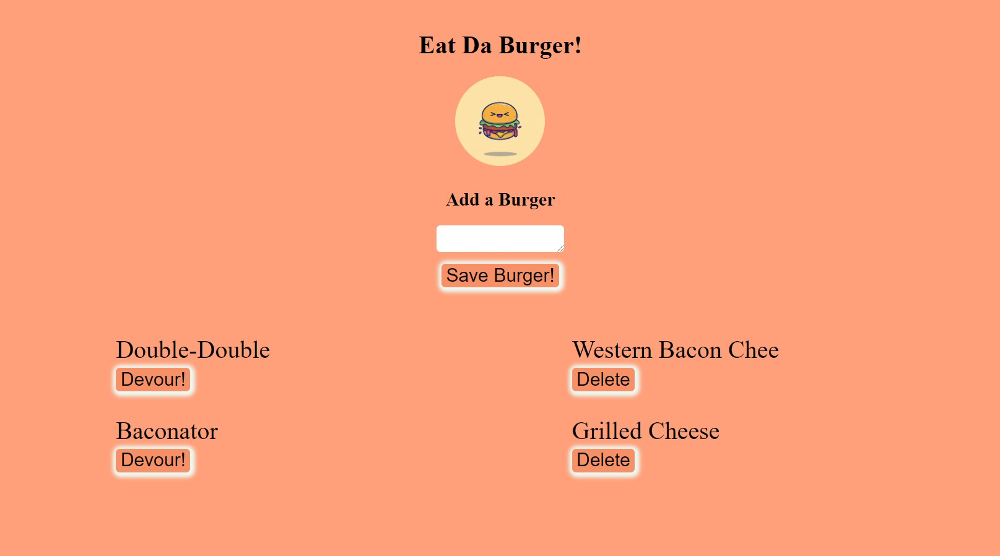

# Eat Da Burger!


## Description

Eat Da Burger! This app allows a user store, devour, and delete burgers from a user created list.

### _Visit this website by clicking the link below_
[Eat Da Burger!](https://burger-tniles.herokuapp.com/)



## Table of Contents 

* [Installation](#installation)

* [Usage](#usage)

* [License](#license)

* [Contribution Guidelines](#contribution-guidelines)

* [Tests](#tests)

* [Questions](#questions)

## Installation

Run the following command to install dependencies:

```
npm install
```

## Usage

To use this application, simply enter in the name of a burger you wish to add, click the 'add burger' button and your burger will be displayed in the list of burgers. From the list you may choose to devour a burger, or if a burger has already been devoured you may delete it from the list if you wish.

## License

This project is licensed under MIT

## Contribution Guidelines

Currently there are no contribution guidelines for this repo.

## Tests

Run the following command in the terminal to run tests:

```
no tests currently for this repo
```

## Questions

If you have any questions regarding this repo, you may contact me at tniles320@gmail.com. To see my other work, follow this link: [GitHub](https://github.com/tniles320/).